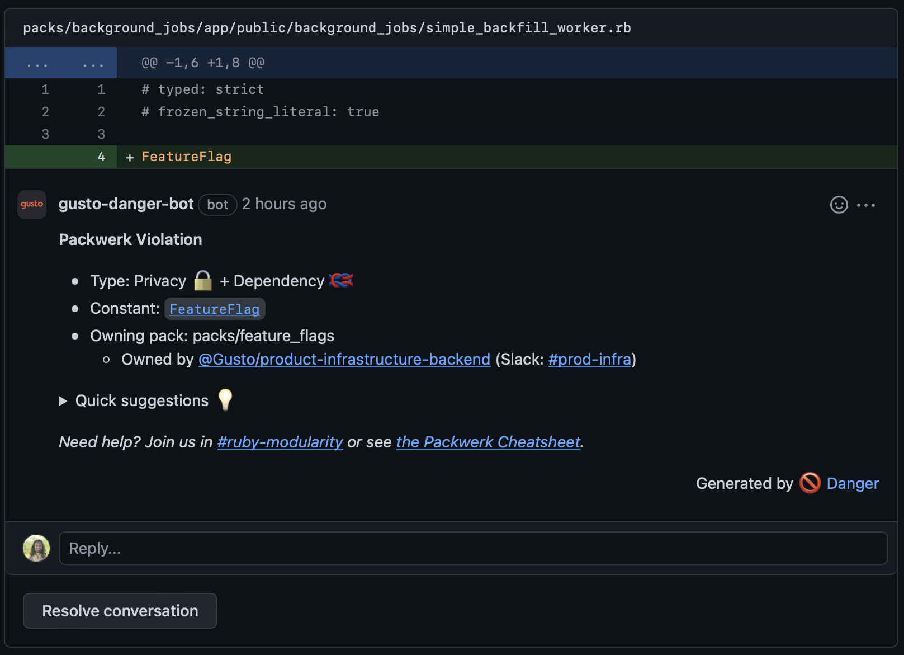
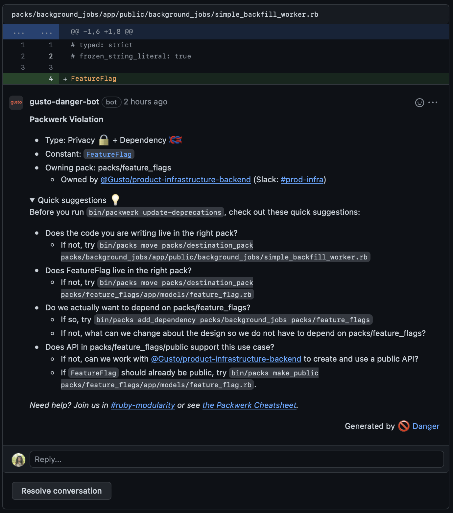
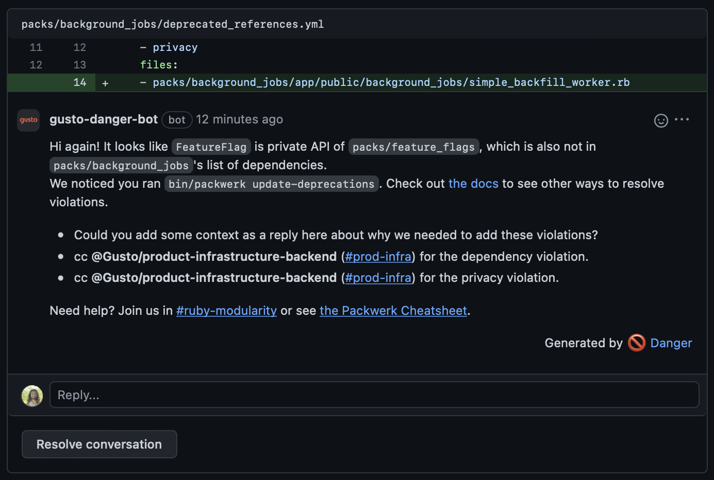

# danger-packwerk

`danger-packwerk` integrates [`packwerk`](https://github.com/Shopify/packwerk) with [`danger`](https://github.com/danger/danger) to provide inline comments in PRs related to boundaries in a Rails application.

## Installation and Basic Usage
Step 1: Add this line to your `Gemfile` (to whatever group your CI uses, as it is not needed in production) and `bundle install`:

```ruby
gem 'danger-packwerk', group: :test
```

Step 2: Add these to your `Dangerfile`:

```ruby
packwerk.check
package_todo_yml_changes.check
```

That's it for basic usage!

## Advanced Usage

There are currently two danger checks that ship with `danger-packwerk`:
1) One that runs `bin/packwerk check` and leaves inline comments in source code on new violations
2) One that looks at changes to `package_todo.yml` files and leaves inline comments on added violations.

In upcoming iterations, we will include other danger checks, including:
1) A danger check that detects changes to `package.yml` files and posts user-configurable messages on the `package.yml` files that are modified.
2) A danger check that detects changes to `packwerk.yml` files and allows you to specify the action taken when that happens.

## packwerk.check



Without any configuration, `packwerk.check` should just work. By default, it will post a maximum of 15 messages in a PR and it will not fail the build.

`packwerk.check` can be configured to in the following ways:

### Change the message that displays in the markdown
To customize the message in the GitHub comment, pass in `offenses_formatter` to `packwerk.check` in your `Dangerfile`. Here's a simple example:
```ruby
class MyFormatter
  extend T::Sig
  include DangerPackwerk::Check::OffensesFormatter
  # Packwerk::ReferenceOffense: https://github.com/Shopify/packwerk/blob/main/lib/packwerk/reference_offense.rb
  sig { override.params(offenses: T::Array[Packwerk::ReferenceOffense], plugin: Danger::Plugin, org_name: String).returns(String) }
  def format_offenses(offenses, plugin, org_name)
    # your logic here
  end
end

packwerk.check(offenses_formatter: MyFormatter.new)
```

If you'd like to keep the default messaging but add some context customized to your organization, you can pass that in as follows:
```ruby
custom_help_message = "Need help? Check out our internal docs [here](www.example.com)"
packwerk.check(offenses_formatter: DangerPackwerk::Check::DefaultFormatter.new(custom_help_message: custom_help_message))
```

### Fail the build on new violations
Simply pass in `fail_build: true` into `check`, as such:
```ruby
packwerk.check(fail_build: true)
```

If you want to change the default error message, which is `Packwerk violations were detected! Please resolve them to unblock the build.`, then you can also pass in `failure_message`.

### Change the max number of comments that will display
If you do not change this, the default max is 15. More information about why we chose this number in the source code.
```ruby
packwerk.check(max_comments: 3)
```

### Do something extra when there are packwerk failures
Maybe you want to notify slack or do something else when there are packwerk failures.

```ruby
packwerk.check(
  # Offenses are a T::Array[Packwerk::ReferenceOffense] => https://github.com/Shopify/packwerk/blob/main/lib/packwerk/reference_offense.rb
  on_failure: -> (offenses) do
    # Notify slack or otherwise do something extra!
  end
)
```

## package_todo_yml_changes.check


Without any configuration, `package_todo_yml_changes.check` should just work. By default, it will post a maximum of 15 messages in a PR, using default messaging defined within this gem.

`package_todo_yml_changes.check` can be configured to in the following ways:

### Change the message that displays in the markdown
To customize the message in the GitHub comment, pass in `offenses_formatter` to `package_todo_yml_changes.check` in your `Dangerfile`. Here's a simple example:
```ruby
class MyFormatter
  extend T::Sig
  include DangerPackwerk::Update::OffensesFormatter
  # DangerPackwerk::BasicReferenceOffense
  sig { override.params(offenses: T::Array[DangerPackwerk::BasicReferenceOffense], plugin: Danger::Plugin, org_name: String).returns(String) }
  def format_offenses(offenses, plugin, org_name)
    # your logic here
  end
end

package_todo_yml_changes.check(offenses_formatter: MyFormatter.new)
```

If you'd like to keep the default messaging but add some context customized to your organization, you can pass that in as follows:
```ruby
custom_help_message = "Need help? Check out our internal docs [here](www.example.com)"
package_todo_yml_changes.check(offenses_formatter: DangerPackwerk::Update::DefaultFormatter.new(custom_help_message: custom_help_message))
```

### Change the max number of comments that will display
If you do not change this, the default max is 15. More information about why we chose this number in the source code.
```ruby
package_todo_yml_changes.check(max_comments: 3)
```

### Do something extra before we leave comments
Maybe you want to notify slack or do something else before we leave comments.

```ruby
package_todo_yml_changes.check(
  # violation_diff is a DangerPackwerk::ViolationDiff and changed_package_todo_ymls is a T::Array[String]
  before_comment: -> (violation_diff, changed_package_todo_ymls) do
    # Notify slack or otherwise do something extra!
  end
)
```

## Development

We welcome your contributions! Please create an issue or pull request and we'd be happy to take a look.
